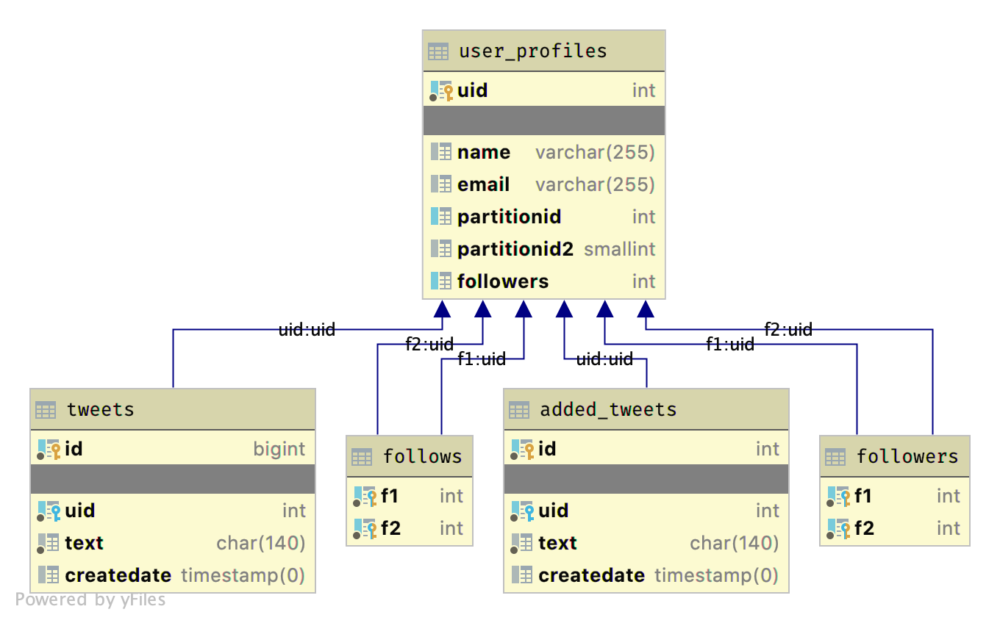

# Benchbase<br/>for Postgres Temporal Queries

Paul A. Jungwirth

22 August 2024

pdxpug

Notes:

- Hi again! I'm Paul Jungwirth, a freelance developer here in Portland.
- I've been working on adding SQL:2011 temporal support to Postgres, in one way or another, for about 10 years.
- I wanted to benchmark a bunch of temporal things, including a few different implementations for temporal foreign keys.
- The thing about temporal is that you have completely different tables: each row has a start & end time to say when it was true.
    - We call this valid time or application time.
- No existing benchmark has tables like that, so I've had to write my own.
- At first I was using pgbench, but it comes with built-in tables that I had to just ignore.
- Mark Wong & Grant Holly suggested using benchbase instead, so that's what I've done.
- I'm pretty new to benchmarking.
	- Mostly I did this because Peter Eisentraut asked me if I'd done any tests on how my patch performed.
		- That was in (checks notes) February.
	- So this is really a talk about a journey, maybe even about personal growth and redemption.


# Outline

- How to use Benchbase
- Comparing temporal foreign key implementations
- ~More temporal procedures~
- Benchmarking mistakes and lessons

Notes:

- Here is what I want to talk about today.
    - Go over benchbase.
        - I found there was very little documentation, so hopefully this talk with help someone else get started.
        - I'll talk about what it offers, how to run it, and how to extend it.
    - I'll go into detail about how I'm comparing three implementations for temporal foreign keys.
        - This is a nice example of a microbenchmark.
        - It's where I've spent the most time so far.
    - I wanted to show some procedures for other temporal operations, like inner join, outer join, semijoin, and antijoin.
        - But this talk is already too long, so I left that out.
        - Still, the benchmark I build includes those things, and I'll touch on them.
        - As far as I know no one has ever published a temporal benchmark, so I'm trying to cover all the procedures you might want to do.
        - You can use this to contruct a broader benchmark that is representative of a real application.
    - I also want to talk about things I've done wrong, and my steps toward a benchmarking methodology.
- This is all still a work in progress, so I'm hoping you can all offer some of your own wisdom to improve what I'm doing.


# History


Notes:

- Benchbase is a tool from Carneige-Mellon University for benchmarking databases.
- It was originally called OLTP-Bench, developed for a paper published in 2013.
- It comes with about 20 benchmarks with support for nearly that many database systems.
- So it solves an `n*m` problem because now you can run any benchmark on any database---in theory anyway.
- You write each benchmark with standards-compliant SQL, and then you can write database-specific overrides as necessary.


# Benchmarks

```console
paul@tal:~/src/benchbase$ ls \
> src/main/java/com/oltpbenchmark/benchmarks/
auctionmark  README.md         templated  voter
chbenchmark  resourcestresser  temporal   wikipedia
epinions     seats             tpcc       ycsb
hyadapt      sibench           tpcds
noop         smallbank         tpch
otmetrics    tatp              twitter
```

Notes:

- Here are the benchmarks you get.
    - tpcc and tpch are two standard benchmarks that aim to behave like a real application.
    - Some other real-world benchmarks are twitter and wikipedia.
    - There are some microbenchmarks like SIBench and YCSB.
    - The paper talks about why they included the various items here.
- Each benchmark is a collection of SQL queries, and you can mix them in whatever proportions you like.

- You can see I've added my own `temporal` benchmark.
    - This is just two tables: employees and the positions they've held.
    - There is a temporal database paper from 2012 with microbenchmarks against similar tables.
        - They said it was 85,000 employees from the University of Arizona's "Incumben" data set.
        - I haven't been able to find that dataset anywhere.
        - I asked one of the paper authors, but I haven't heard back yet.
        - It would be nice to have some real data instead of faking it.


# Benchmarks



Notes:

- The Github wiki has a page for each benchmark.
    - It has a schema diagram, shown here.
    - It also tells you which DBMS vendors they have tested against the benchmark.
        - Every one I checked just said Postgres, MySQL, and Cockroach,
          but there is code to support more, so this might be out of date or they just don't want to over-promise.


# DBMSes

```console
paul@tal:~/src/benchbase$ find \
> src/main/resources/benchmarks/ \
> -name 'ddl-*' |
> xargs -L1 basename |
> sort -u |
> pr -t -2
ddl-cassandra.sql           ddl-nuodb.sql
ddl-cockroachdb.sql         ddl-oracle.sql
ddl-db2.sql                 ddl-phoenix.sql
ddl-generic.sql             ddl-postgres.sql
ddl-hsqldb.sql              ddl-singlestore.sql
ddl-monetdb.sql             ddl-spanner.sql
ddl-myrocks.sql             ddl-sqlite.sql
ddl-mysql.sql               ddl-sqlserver.sql
ddl-noisepage.sql           ddl-timesten.sql
```

Notes:

- Each benchmark has a setup file with DDL commands.
- DDL is typically the least standard across vendors, so each benchmark can have vendor-specific files.
- Not every benchmark supports every vendor, but if something is missing it's easy to add.
- Besides these `ddl-*` scripts there are also `dialect-*` scripts, also named for the DBMS vendor.
    - If a benchmark's default SQL doesn't work somewhere, you can override it for a specific vendor.
  


# Quickstart

```console
git clone https://github.com/cmu-db/benchbase.git
cd benchbase
./mvnw clean package -P postgres

cd target
tar xvzf benchbase-postgres.tgz
cd benchbase-postgres

java -jar benchbase.jar -b tpcc \
  -c config/postgres/sample_tpcc_config.xml \
  --create=true --load=true --execute=true
```

Notes:

- Here is some code from the README.
- Clone the repo, build the project, generate a tarball for your RDBMS.
- Then run a benchmark, passing a config file and some options.


# Oneliner

```console[|2|3|4]
mvn clean compile exec:java -P postgres \
  -Dexec.args="-b tpcc \
  -c config/postgres/sample_tpcc_config.xml \
  --create=true --load=true --execute=true"
```

https://github.com/cmu-db/benchbase/pull/548

Notes:

- Here is the same thing, but as a one-liner.
- This is what I've been doing, since I'm building the benchmark as I go.
- This is also from the README, but actually it's been broken since 2023.
- I have a PR that makes it work again, linked here.
- So `-b` gives the benchmark you want to run.
- `-c` gives the config file to use. I'll cover that in a moment.
- `--create` doesn't mean `CREATE DATABASE`, but rather runs your DDL script.
- `--load` is to fill your tables with some initial data. This isn't counted in the benchmark results.
- `--execute` actually runs the benchmark.
- I found it useful to run with `--create` and `--load` but not `--execute`,
  then use the result as a Postgres template db,
  so that each time I run the benchmark I can skip the loading work.
  - This helps with iteration speed, but for more accurate results you should probably do everything together.
    - There is a benchmarking talk where Melanie Plageman advises running `initdb` before every benchmark,
      because apparently initializing your first WAL files is a decent amount of work,
      and if you don't always include it your runs won't be comparable.


# Config file

```xml
<type>POSTGRES</type>
<driver>org.postgresql.Driver</driver>
<url>jdbc:postgresql://localhost:5460/benchbase?reWriteBatchedInserts=true</url>
<username>paul</username>
<password></password>
<reconnectOnConnectionFailure>true</reconnectOnConnectionFailure>
<isolation>TRANSACTION_READ_COMMITTED</isolation>
<newConnectionPerTxn>false</newConnectionPerTxn>
```

Notes:

- This is an XML file you name on the command line above.
- It has some details to connect to your database.
- This is virtually undocumented.
    - The old github repo has a wiki page that covers some of it, but it wasn't copied over when the project was renamed.
    - I learned a lot by reading the OLTP Bench paper.
        - There is tons of power you can harness with this file.
    - I learned a lot by reading the config parsing code.
    - I'll spend some time here because the project deserves a more complete reference.
- Reconnect on failure: I haven't really looked at this. Does a failure make it just stop?
- Transaction isolation level
- `newConnectionPerTxn` means what it says.
    - By default this is false.
    - If you wanted to measure connection overhead, you could turn it on.


# Config file

```xml
<scalefactor>10000</scalefactor>
<batchsize>128</batchsize>
```

Notes:

- `scalefactor` is for the loading step: in other words the initial data.
  - A benchmark can do whatever it wants with this, but basically it's a multipler.
      - For Twitter, at `scalefactor` 1 you get 500 users and 20,000 tweets.
      - For TPCC the `scaleFactor` is the number of warehouses.
- `batchsize` is also just for loading, and it lets the benchmark group `INSERT`s to cut down on overhead.


# Config file

```xml
<transactiontypes>
    <transactiontype>
        <name>InsertPosition</name>
    </transactiontype>
    <transactiontype>
        <name>UpdatePosition</name>
    </transactiontype>
    <transactiontype>
        <name>UpdateEmployee</name>
    </transactiontype>
    <transactiontype>
        <name>DeleteEmployee</name>
    </transactiontype>
</transactiontypes>
```

Notes:

- `transactiontypes` has one element for each "procedure" your benchmark can run.
  - Each of these is a Java class file that runs a transaction.
    - Every file I've seen has been JDBC code wrapping a single SQL statement, usually with some parameters.
  - Here is one procedure for each command that can cause a foreign key check:
    - On the referenced side, an update or delete (but not an insert).
    - On the referencing side, an insert or an update (but not a delete).


# Config file

```xml
<terminals>10</terminals>
<works>
    <work>
        <time>600</time>
        <rate>10000</rate>
        <weights>28,28,28,16</weights>
    </work>
</works>
```

Notes:

- `terminals` is concurrency.
    - It's the number of simultaneous clients.
    - So in Postgres, assuming we leave `newConnectionPerTxn` false, we expect to get one backend per terminal.
    - I think this vocabulary comes from TPC-C.
        - Maybe Mark or Grant can say more about that.
    - The truth is, each benchmark needs Java code to respect this, or the setting does nothing.
        - I'll get to that....
- `works` has one or more `work` elements, and each one is a "phase".
  - The OLTP Bench paper does some cool stuff with different phases.
  - `weights` refers to the percent of the corresponding `transactiontype` from the last slide.
    - These have to add to 100.
    - So I'm saying we want 28% of the transactions to insert a position, 28% to update a position,
      28% to update an employee, and only 16% to delete an employee.
- `time` is how many seconds the phase lasts, so here I'm benchmarking for 10 minutes.
- `rate` is a way to insert "think time".
    - It is the attempted transactions per second, for each terminal.
    - 10k pretty much means "don't think".
    - If we don't achieve this rate, it's no big deal. It's a way to slow things down, not speed things up.
    - You can also give `disabled` which means "skip this phase".
    - The little I could find about `rate` was unclear about its units or what it really did,
      so I just had to read the code for this.
- You can have more than one `work` element.
    - Each phase will start when the prior one finishes.


# Config file

```xml [3,7]
<terminals>10</terminals>
<works>
    <work arrival="poisson">
        <time>600</time>
        <rate>10000</rate>
        <weights>28,28,28,16</weights>
        <active_terinals>5</active_terminals>
    </work>
</works>
```

Notes:

- Here are a couple optional things, again undocumented.
- `poisson` lets you start a phase gradually instead of all at once.
  - The OLTP Bench mentions doing this, but they don't say how.
- And `active_terminals` lets you vary the connections for just that phase.
  - The other terminals won't do anything.


# Results

```txt [|2|3|4]
paul@tal:~/src/benchbase$ ls -1 results
temporal_2024-07-28_20-10-41.config.xml
temporal_2024-07-28_20-10-41.metrics.json
temporal_2024-07-28_20-10-41.params.json
temporal_2024-07-28_20-10-41.raw.csv
temporal_2024-07-28_20-10-41.results.DeleteEmployee.csv
temporal_2024-07-28_20-10-41.results.InsertPosition.csv
temporal_2024-07-28_20-10-41.results.UpdateEmployee.csv
temporal_2024-07-28_20-10-41.results.UpdatePosition.csv
temporal_2024-07-28_20-10-41.results.csv
temporal_2024-07-28_20-10-41.samples.csv
temporal_2024-07-28_20-10-41.summary.json
```

Notes:

- When you run your benchmark you get a bunch of files.
- The `.config.xml` file is a copy of the config file you used.
  - This is great because it captures what you were doing.

- The `metrics.json` file a `SELECT *` from `pg_stat_database`, `pg_stat_user_indexes`, `pg_statio_user_tables`, `pg_stat_bgwriter`, `pg_stat_user_tables`, `pg_statio_user_indexes`, `pg_stat_archiver`, and `pg_stat_database_conflicts`.
  - I assume it runs this after your benchmark is done, but I haven't confirmed this. (TODO)

- The `params.json` file is a `SHOW ALL`. So it captures whatever settings you had for Postgres.


# `*.raw.csv`

```console
Transaction Type Index,Transaction Name,Start Time (microseconds),Latency (microseconds),Worker Id (start number),Phase Id (index in config file)
4,DeleteEmployee,1722222636.414196,6786,0,1
3,UpdateEmployee,1722222636.421013,1045,0,1
1,InsertPosition,1722222636.422064,1402,0,1
4,DeleteEmployee,1722222636.423471,1555,0,1
1,InsertPosition,1722222636.425031,722,0,1
1,InsertPosition,1722222636.425761,682,0,1
```

Notes:

- The `raw.csv` file records every transaction you ran.
  - There's the transaction type,
  - The start time,
  - How long it took,
  - Which terminal ran it,
  - And which phase it's from.


# `*.results.csv`

```console
Time (seconds),Throughput (requests/second),Average Latency (millisecond),Minimum Latency (millisecond),25th Percentile Latency (millisecond),Median Latency (millisecond),75th Percentile Latency (millisecond),90th Percentile Latency (millisecond),95th Percentile Latency (millisecond),99th Percentile Latency (millisecond),Maximum Latency (millisecond),tp (req/s) scaled
0,509.600,6.567,4.936,6.317,6.503,6.645,6.822,6.964,9.793,12.677,0.152
5,540.200,6.213,5.167,6.034,6.120,6.245,6.358,6.629,9.088,13.373,0.161
10,533.200,6.241,5.294,6.032,6.164,6.277,6.459,6.578,9.078,13.399,0.160
15,539.800,6.214,2.761,5.934,6.178,6.529,6.755,7.813,12.855,30.075,0.161
20,739.600,4.531,2.659,3.466,3.546,5.144,6.877,7.059,11.450,58.569,0.221
```

Notes:

- Then you get one file for each procedure type.
    - Here is UpdateEmployee.
- The has one row every five seconds,
  with throughput and latency numbers.
- You also have a combined `results.csv` file with the same structure, but mixing all procedure types together.


# `*.samples.csv`

```console
Time (seconds),Requests,Throughput (requests/second),Minimum Latency (microseconds),25th Percentile Latency (microseconds),Median Latency (microseconds),Average Latency (microseconds),75th Percentile Latency (microseconds),90th Percentile Latency (microseconds),95th Percentile Latency (microseconds),99th Percentile Latency (microseconds),Maximum Latency (microseconds)
0,1780,1780.000,153,6225,6402,5613,6576,6756,7137,9928,12692
1,1794,1794.000,132,6360,6592,5582,6690,6835,6870,8501,9909
2,1795,1795.000,136,6351,6570,5568,6693,6833,6951,9773,10577
3,1803,1803.000,122,6241,6468,5531,6591,6750,6893,9495,9803
4,1901,1901.000,95,6035,6216,5249,6318,6438,6497,7804,10805
```

Notes:

- The `sample` file has nearly the same thing, although it includes the number of requests.
- You can control the frequency of this file with the `--sample` command-line option.


# `*.summary.json`

```js
{
 "Start timestamp (milliseconds)": 1723441031104,
 "Current Timestamp (milliseconds)": 1723441634718,
 "Elapsed Time (nanoseconds)": 600000068387,
 ...
 "Measured Requests": 1147862,
 "Latency Distribution": {
  "95th Percentile Latency (microseconds)": 7405,
  "Maximum Latency (microseconds)": 58595,
  "Median Latency (microseconds)": 6198,
  "Minimum Latency (microseconds)": 80,
  "25th Percentile Latency (microseconds)": 5135,
  "90th Percentile Latency (microseconds)": 6636,
  "99th Percentile Latency (microseconds)": 11254,
  "75th Percentile Latency (microseconds)": 6411,
  "Average Latency (microseconds)": 5225
 },
 "Throughput (requests/second)": 1913.103115281029,
 "Goodput (requests/second)": 1891.3147844310931
}
```

Notes:

- The `summary` file gives you total results.


# TODO: monitor-type=advanced


# More CLUI Options

```console
--sample
--monitor-type=advanced
--interval-monitor=1000


# Benchmark Architecture

```console
paul@tal:~/src/benchbase$ ls -1 \
> src/main/java/com/oltpbenchmark/benchmarks/temporal/
DateRange.java
Employee.java
Position.java
TemporalBenchmark.java
TemporalConfiguration.java
TemporalConstants.java
TemporalLoader.java
TemporalModel.java
TemporalWorker.java
procedures
```

Notes:

- Here is what you implement to make a new benchmark.
  - In fact this is more than you need.
  - `TemporalBenchmark` is like the entry point.
  - `TemporalConstants` defines things like how many employees to start with.
  - `TemporalConfig` lets you include custom XML elements in the config file, if you want to tune things.
    - For instance I provide some knobs for the timestamp targeted by employee & position updates & deletes.
  - `TemporalLoader` does the initial data load.
  - `procedures` has individual classes for each procedure type, as I mentioned before.
  - `TemporalWorker` is the real brains of your benchmark.
    - The benchbase framework will build a queue of transactions, and each worker pops a transaction off the queue and runs it.
    - If your procedures take parameters, here you can choose random values for them.


# `TemporalWorker`

```java [|2-3|6|14|8-9]
@Override
protected TransactionStatus executeWork(
  Connection conn, TransactionType nextTrans)
  throws UserAbortException, SQLException {
try {
  if (nextTrans.getProcedureClass().equals(InsertPosition.class)) {
	RandomEmployee emp = makeRandomEmployee(
			TemporalConstants.CHECK_FK_GAUSSIAN_RANGE,
            config.getMaxYearsInsertPositionRange());
	String duty = TemporalConstants.POSITION_NAMES[
			rng().nextInt(TemporalConstants.POSITION_NAMES.length)];
	int rank = 1;

	getProcedure(InsertPosition.class).run(conn, emp.id, duty, emp.s, emp.e, rank);

  } else if (nextTrans.getProcedureClass().equals(UpdatePosition.class)) {
	RandomPosition p = makeRandomPosition(config.getMaxYearsUpdatePositionRange());

	getProcedure(UpdatePosition.class).run(conn, p.id, p.employeeId, p.duty, p.rank, p.s);
```

Notes:

- This `executeWork` method gets calls with each item from the queue.
- It runs the appropriate procedure.
- Here are a couple examples, where I'm picking random ids and start/end times.
- I'm referencing both `TemporalConstants` and the `config` object, which is a `TemporalConfiguration` instance.


# Procedures

```java[|4-6|2]
public class InsertPosition extends Procedure {
  public final SQLStmt insertPosition =
    new SQLStmt(
      "INSERT INTO positions (employee_id, valid_at, name) " +
      "VALUES (?, daterange(?, ?), " +
      "concat(?, ' ', to_char(?, 'RN'))) RETURNING id");
        
  public int run(
    Connection conn, int employeeId, String duty,
    LocalDate s, LocalDate e, int rank)
    throws SQLException {
    try (PreparedStatement stmt = this.getPreparedStatement(conn, insertPosition)) {
      stmt.setInt(1, employeeId);
      stmt.setDate(2, s == null ? null : Date.valueOf(s));
      stmt.setDate(3, e == null ? null : Date.valueOf(e));
      stmt.setString(4, duty);
      stmt.setInt(5, rank);
      stmt.execute();
      return -1;
    }       
  }             
}
```

Notes:

- Here is a procedure example.
- What you call this variable is important.
- Benchbase will use some reflection (I guess) and treats this as a "query id" in your results files.


# Tests

```console
paul@tal:~/src/benchbase$ ls \
> src/test/java/com/oltpbenchmark/benchmarks/
auctionmark  resourcestresser  temporal  wikipedia
chbenchmark  seats             tpcc      ycsb
epinions     smallbank         tpch
noop         tatp              twitter
otmetrics    templated         voter
```

Notes:

- Each benchmark has tests.
	- Basically it runs your benchmark with a very light scale factor, to make sure it doesn't crash.
	- But it runs against hsqldb, a Java-based benchmark.
	- hsqldb doesn't support application-time tables, so we can't really use this.
	- But we can do the same thing against Postgres running things normally.


# Temporal DDL

```sql
DROP EXTENSION IF EXISTS btree_gist CASCADE;
DROP TABLE IF EXISTS employees CASCADE;
DROP TABLE IF EXISTS positions CASCADE;

CREATE EXTENSION btree_gist;

CREATE TABLE employees (
  id          int GENERATED BY DEFAULT AS IDENTITY NOT NULL,
  valid_at    daterange NOT NULL,
  name        text NOT NULL,
  salary      int NOT NULL,
  PRIMARY KEY (id, valid_at WITHOUT OVERLAPS)
);

CREATE TABLE positions (
  id          int GENERATED BY DEFAULT AS IDENTITY NOT NULL,
  valid_at    daterange NOT NULL,
  name        text NOT NULL,
  employee_id int NOT NULL,
  PRIMARY KEY (id, valid_at WITHOUT OVERLAPS),
  FOREIGN KEY (employee_id, PERIOD valid_at)
    REFERENCES employees (id, PERIOD valid_at)
);
CREATE INDEX idx_positions_employee_id ON positions
  USING gist (employee_id, valid_at);
```

Notes:

- Here is the DDL for my temporal benchmark.
- We have employees with an id, a name, and a salary.
- We have positions with a name.
	- Each one is attached to an employee.
- Both tables have a `valid_at` column, which is a daterange.
- There is some new syntax here:
	- The primary keys have `WITHOUT OVERLAPS`.
      You can have multiple rows for employee 5, as long as their valid time doesn't overlaps.
	- The foreign keys have `PERIOD`:
	  The id part has to match, and the referenced row has to cover at least as much time as the referencing row.
	  Actually if an employee had a position for all of 2023, but they got a raise in the middle of the year,
      you need the aggregate of *both* employee records to fulfill the foreign key constraint.


# Temporal Foreign Keys


Notes:

- Here is a diagram of that.


# `range_agg` implementation

```sql
SELECT 1
FROM    (
  SELECT pkperiodatt AS r
  FROM   [ONLY] pktable x
  WHERE  pkatt1 = $1 [AND ...]
  AND    pkperiodatt && $n
FOR KEY SHARE OF x
) x1
HAVING $n <@ range_agg(x1.r)
```

Notes:

- Here is the SQL used to check if a referencing row is valid.
- This is from my patch adding temporal foreign keys to Postgres.
- This query is why I starting working on multiranges back in 2019.
  - Otherwise `range_agg` could fail, because a regular range can't have a gap in the middle.
- I'll call this implementation the `range_agg` implementation.


# `EXISTS` implementation

```sql
SELECT 1
-- There was a PK when the FK started:
WHERE EXISTS
  SELECT  1
  FROM    [ONLY] <pktable>
  WHERE   pkatt1 = $1 [AND ...]
  AND     COALESCE(lower(pkperiodatt), '-Infinity')
       <= COALESCE(lower($n), '-Infinity')
  AND     COALESCE(lower($n), '-Infinity')
       <  COALESCE(upper(pkperiodatt), 'Infinity')
)
...
```

Notes:

- The original temporal foreign key SQL was giving in 1999 by Richard Snodgrass,
  in his book *Developing Time-Oriented Applications in SQL*, page 128-129.
- What we check for is:
  - (1) the start of the referencing time must be covered
  - (2) the end of the referencing time must be covered
  - (3) there can't be any gaps in the middle
- This is part one.


# `EXISTS` implementation

```sql
-- There was a PK when the FK ended:
AND EXISTS (
  SELECT  1
  FROM    [ONLY] <pktable>
  WHERE   pkatt1 = $1 [AND ...]
  AND     COALESCE(lower(pkperiodatt), '-Infinity')
       <  COALESCE(upper($n), 'Infinity')
  AND     COALESCE(upper($n), 'Infinity')
       <= COALESCE(upper(pkperiodatt), 'Infinity')
)
...
```

Notes:

- This is part 2.


# `EXISTS` implementation

```sql
-- There are no gaps in the PK:
-- (i.e. there is no PK that ends early,
-- unless a matching PK record starts right away)
AND NOT EXISTS (
  SELECT  1
  FROM    [ONLY] <pktable> AS pk1
  WHERE   pkatt1 = $1 [AND ...]
  AND     COALESCE(lower($n), '-Infinity')
       <  COALESCE(upper(pkperiodatt), 'Infinity')
  AND     COALESCE(upper(pkperiodatt), 'Infinity')
       <  COALESCE(upper($n), 'Infinity')
  ...
```

Notes:

- This is part 3.


# `EXISTS` implementation

```sql
  AND     NOT EXISTS (
    SELECT  1
    FROM    [ONLY] <pktable> AS pk2
    WHERE   pk1.pkatt1 = pk2.pkatt1 [AND ...]
            -- but skip pk1.pkperiodatt && pk2.pkperiodatt
    AND     COALESCE(lower(pk2.pkperiodatt), '-Infinity')
         <= COALESCE(upper(pk1.pkperiodatt), 'Infinity')
            COALESCE(upper(pk1.pkperiodatt), 'Infinity')
         <  COALESCE(upper(pk2.pkperiodatt), 'Infinity')
  )
)
```

Notes:

- This is part 4.
- So two things make me think this query is going to be really slow:
  - Triple boolean.
	- The original from the book uses OR.
    - The way Postgres checks its FKs, the logic is a bit inverted, and we have ANDs instead.
		- Postgres doesn't seem to do well with ORs, so that's good.
  - NOT EXISTS inside NOT EXISTS.
	- Again this is a small improvement on the original, which has NOT EXISTS inside EXISTS inside NOT EXISTS.


# `lag` implementation

```sql
SELECT  1
FROM    (
  SELECT  uk.uk_start_value,
          uk.uk_end_value,
          NULLIF(LAG(uk.uk_end_value) OVER (ORDER BY uk.uk_start_value), uk.uk_start_value) AS x
  FROM   (
    SELECT  coalesce(lower(x.pkperiodatt), '-Infinity') AS uk_start_value,
            coalesce(upper(x.pkperiodatt), 'Infinity') AS uk_end_value
    FROM    pktable AS x
    WHERE   pkatt1 = $1 [AND ...]
    AND     uk.pkperiodatt && $n
    FOR KEY SHARE OF x
  ) AS uk
) AS uk
WHERE   uk.uk_start_value < upper($n)
AND     uk.uk_end_value >= lower($n)
HAVING  MIN(uk.uk_start_value) <= lower($n)
AND     MAX(uk.uk_end_value) >= upper($n)
AND     array_agg(uk.x) FILTER (WHERE uk.x IS NOT NULL) IS NULL
```

Notes:

- Here is another implementation by Vik Fearing, from his `periods` extension.
- This is like Snodgrass's idea, but it uses the `lag` window function to exclude gaps.
- As with Snodgrass's code, I had to make some adaptations to fit it into Postgres's foreign-key checking framework.
	- Also I made it work with ranges instead of separate start/end columns.


# Compiler Flags

```c
#if defined(RI_TEMPORAL_IMPL_LAG)                                                                
    quoteOneName(attname,                                                                                         RIAttName(pk_rel, riinfo->pk_attnums[riinfo->nkeys - 1]));              
                                                                                         
    appendStringInfo(&querybuf, "SELECT 1 FROM ( ");                                     
    appendStringInfo(&querybuf, "  SELECT  uk.uk_start_value, uk.uk_end_value, ");       
    appendStringInfo(&querybuf, "          NULLIF(LAG(uk.uk_end_value) OVER (ORDER BY uk.uk_start_value), uk.uk_start_value) AS x ");                                                     
    appendStringInfo(&querybuf, "  FROM    ( ");                                         
    appendStringInfo(&querybuf, "    SELECT  COALESCE(LOWER(x.%s), '-Infinity') AS uk_start_value, ", attname);                                                                           
    appendStringInfo(&querybuf, "            COALESCE(UPPER(x.%s), 'Infinity') AS uk_end_value ", attname);                                                                               
    appendStringInfo(&querybuf, "    FROM    %s%s AS x", pk_only, pkrelname);            
#elif defined(RI_TEMPORAL_IMPL_EXISTS)                                                           
    appendStringInfo(&querybuf,                                                          
                     "SELECT 1 ");                                                       
#else                                                                                            
    quoteOneName(attname,                                                                
                 RIAttName(pk_rel, riinfo->pk_attnums[riinfo->nkeys - 1]));              
                                                                                         
    appendStringInfo(&querybuf,                                                          
                     "SELECT 1 FROM (SELECT %s AS r FROM %s%s x",                        
                     attname, pk_only, pkrelname);                                       
#endif   
```

Notes:

- I modified my patch to allow all these implementations.
    - In Postges foreign keys are really triggers, and they build SQL to make sure changing rows are still valid.
	- This isn't the .patch file I've submitted on the mailing list, but it's a separate branch on my github repo.
    - So now I can build three different Postgres clusters and compare them.


# `EXPLAIN range_agg`

```console
Aggregate
  Filter: ('[2020-10-10,2020-12-12)'::daterange <@ range_agg(x1.r))
  ->  Subquery Scan on x1
    ->  LockRows
      ->  Index Scan using employees_pkey on employees x
        Index Cond: ((id = 500) AND (valid_at && '[2020-10-10,2020-12-12)'::daterange))
```

Notes:

- Here is the query plan for the `range_agg`.
- It's really simple!
- It uses the GiST index.
- I'm not sure why this is an Index Scan not an Index Only Scan.
    - I guess it's because of locking:
      If I omit `FOR KEY SHARE` then it's Index Only.
- I've left off costs and not shown actual times, just to make it fit on the slide.


# `EXPLAIN lag`

```console
Aggregate
  Filter: ((array_agg(uk.x) FILTER (WHERE (uk.x IS NOT NULL)) IS NULL) AND (min(uk.uk_start_value) <= '2020-10-10'::date) AND (max(uk.uk_end_value) >= '2020-12-12'::date))
  ->  Subquery Scan on uk
    Filter: ((uk.uk_start_value < '2020-12-12'::date) AND (uk.uk_end_value >= '2020-10-10'::date))
    ->  WindowAgg
      ->  Sort
        Sort Key: uk_1.uk_start_value
        ->  Subquery Scan on uk_1
          ->  LockRows
            ->  Index Scan using employees_pkey on employees x
              Index Cond: ((id = 500) AND (valid_at && '[2020-10-10,2020-12-12)'::daterange))
```

Notes:

- Here is the lag implementation.
- A little more complicated.
- Most important there's a sort we didn't need before.
    - That may not be as important as it sounds:
      probably `range_agg` is doing nearly the same thing internally.


# `EXPLAIN EXISTS`

```console
Result
  One-Time Filter: ((InitPlan 1).col1 AND (InitPlan 2).col1 AND (NOT (InitPlan 4).col1))
  InitPlan 1
  ->  LockRows
    ->  Index Scan using employees_pkey on employees x
      Index Cond: ((id = 500) AND (valid_at && '[2020-10-10,2020-12-12)'::daterange))
      Filter: ((COALESCE(lower(valid_at), '-infinity'::date) <= '2020-10-10'::date) AND ('2020-10-10'::date < COALESCE(upper(valid_at), 'infinity'::date)))
  InitPlan 2
  ->  LockRows
    ->  Index Scan using employees_pkey on employees x_1
      Index Cond: ((id = 500) AND (valid_at && '[2020-10-10,2020-12-12)'::daterange))
      Filter: ((COALESCE(lower(valid_at), '-infinity'::date) < '2020-12-12'::date) AND ('2020-12-12'::date <= COALESCE(upper(valid_at), 'infinity'::date)))
  InitPlan 4
  ->  LockRows
    ->  Index Scan using employees_pkey on employees pk1
      Index Cond: ((id = 500) AND (valid_at && '[2020-10-10,2020-12-12)'::daterange))
      Filter: (('2020-10-10'::date < COALESCE(upper(valid_at), 'infinity'::date)) AND (COALESCE(upper(valid_at), 'infinity'::date) < '2020-12-12'::date) AND (NOT EXISTS(SubPlan 3)))
      SubPlan 3
      ->  LockRows
        ->  Index Scan using employees_pkey on employees pk2
          Index Cond: (id = pk1.id)
          Filter: ((COALESCE(lower(valid_at), '-infinity'::date) <= COALESCE(upper(pk1.valid_at), 'infinity'::date)) AND (COALESCE(upper(pk1.valid_at), 'infinity'::date) < COALESCE(upper(valid_at), 'infinity'::date)))
```

Notes:

- Here is the EXISTS plan.
- It's really complicated!
- They say you should always have a hypothesis.
  - I think my implementation will be fastest, lag second, and EXISTS last.


# Assumptions

Relevant:

- CPU
- Tuples examined
- Number of index scans

Not relevant:

- Shared Buffers
- I/O

Notes:

- We're just comparing these 3 queries.
- None of them are really going to do a lot of I/O, at least all should be about the same.
- Tuning `shared_buffers` will affect them all about the same.
- Looking at CPU during different queries might be interesting.
- Profile something like `heap_getnext` or `index_fetch_heap` might be interesting.


# Early Results


Notes:

- Here are the results of my first run.
	- The script to generate this plot is in another repo, in the references.
- I was right!
- At this point I offered to give this talk.
- Then I started having doubts.
- Okay let's at least look at the latencies:


# Early Results


Notes:

- Benchbase gives us latencies at the 25th, 50th, 75th, 90th, and 99th percentiles.
- range_agg wins again!


# Early Results


Notes:

- Wait, what is this?
- We also get the max latency, and for some reason range_agg is much higher than the rest.
- Surely it's an artifact, right?
- Actually a lot of things are dubious here.
	- I'm just using my own machine, so who knows what is happening at the same time.
	- I'm doing full updates/deletes/inserts, which includes a lot of stuff besides the one query I'm trying to microbenchmark.
		- Is the noise just hiding the signal?
	- Also these plots are just from the summary file.
		- Tufte would be like: Why are you drawing a graph to show three numbers?
		- Why not use the results files and plot against time?
	- Also the TemporalWorker was keeping a lot of state and using that to pick random employees and positions.
		- Maybe you noticed the TemporalModel class and the Employee & Position classes.
		- So I had a bunch of synchronized blocks. (Is that even how you do Java these days?)
			- That's even more noise, assuming I didn't fatally mess up the memory barriers or something.
		- Using the TemporalModel means I must do the load every time, because that's where the model gets built.
		- I want to get away from all that.
			- So I rewrote everything!
- What I could do is write Benchbase procedures just for the three SELECT queries, and run those.
	- Now all three implementations are running together.
	- I don't need three different Postgres clusters.
	- If I'm watching YouTube it will mess up everything equally.


# Surprise


Notes:

- So here is the next result I got.
	- This shows mean latency, so lower is better.
	- Wait, how is EXISTS so much faster??


# Surprise


Notes:

- But at the 95th percentile, the effect flips and `range_agg` is faster again.
- At this point I started to get a little less casual.
	- I remembered my high school chemistry teacher, who was really big on lab books.
		- They had to be in pen.
		- If you wanted to cross something out it had to be a single strikethrough, so it was still legible.
		- The longer I worked the closer I got to that ideal.
	- I started to put a lot more stuff in my repo.
		- Scripts to automate taking benchmarks
		- Results I collected
		- Scripts to make the plots
	- I tried to make things reproducible.
	- I tried to keep notes as I went.
- So what is going on?


# 50% Errors

```console
Completed Transactions:
com.oltpbenchmark.benchmarks.temporal.procedures.CheckForeignKeyRangeAgg/01      [72064] ********************************************************************************
com.oltpbenchmark.benchmarks.temporal.procedures.CheckForeignKeyLag/02           [71479] *******************************************************************************
com.oltpbenchmark.benchmarks.temporal.procedures.CheckForeignKeyExists/03        [71529] *******************************************************************************
com.oltpbenchmark.benchmarks.temporal.procedures.Noop/04                         [ 4585] *****
Aborted Transactions:
<EMPTY>

Rejected Transactions (Server Retry):
<EMPTY>

Rejected Transactions (Retry Different):
<EMPTY>

Unexpected SQL Errors:
com.oltpbenchmark.benchmarks.temporal.procedures.CheckForeignKeyRangeAgg/01      [80861] ********************************************************************************
com.oltpbenchmark.benchmarks.temporal.procedures.CheckForeignKeyLag/02           [80764] *******************************************************************************
com.oltpbenchmark.benchmarks.temporal.procedures.CheckForeignKeyExists/03        [80478] *******************************************************************************
```
<!-- .element class="code-small" -->

Notes:

- Well this is a big clue.
- This is the benchbase output, showing that over half of our foreign key checks were invalid.
- The top section is successful transactions; the bottom, unsuccessful.


# `EXPLAIN ANALYZE EXISTS`
<!-- .element class="r-fit-text" -->

```console[|9,14,19]
Result (actual time=0.034..0.035 rows=0 loops=1)
  One-Time Filter: ((InitPlan 1).col1 AND (InitPlan 2).col1 AND (NOT (InitPlan 4).col1))
  InitPlan 1
  ->  LockRows (actual time=0.033..0.033 rows=0 loops=1)
    ->  Index Scan using employees_pkey on employees x (actual time=0.033..0.033 rows=0 loops=1)
      Index Cond: ((id = 5999) AND (valid_at && '[2020-10-10,2020-12-12)'::daterange))
      Filter: ((COALESCE(lower(valid_at), '-infinity'::date) <= '2020-10-10'::date) AND ('2020-10-10'::date < COALESCE(upper(valid_at), 'infinity'::date)))
  InitPlan 2
  ->  LockRows (never executed)
    ->  Index Scan using employees_pkey on employees x_1 (never executed)
      Index Cond: ((id = 5999) AND (valid_at && '[2020-10-10,2020-12-12)'::daterange))
      Filter: ((COALESCE(lower(valid_at), '-infinity'::date) < '2020-12-12'::date) AND ('2020-12-12'::date <= COALESCE(upper(valid_at), 'infinity'::date)))
  InitPlan 4
  ->  LockRows (never executed)
    ->  Index Scan using employees_pkey on employees pk1 (never executed)
      Index Cond: ((id = 5999) AND (valid_at && '[2020-10-10,2020-12-12)'::daterange))
      Filter: (('2020-10-10'::date < COALESCE(upper(valid_at), 'infinity'::date)) AND (COALESCE(upper(valid_at), 'infinity'::date) < '2020-12-12'::date) AND (NOT EXISTS(SubPlan 3)))
      SubPlan 3
      ->  LockRows (never executed)
        ->  Index Scan using employees_pkey on employees pk2 (never executed)
          Index Cond: (id = pk1.id)
          Filter: ((COALESCE(lower(valid_at), '-infinity'::date) <= COALESCE(upper(pk1.valid_at), 'infinity'::date)) AND (COALESCE(upper(pk1.valid_at), 'infinity'::date) < COALESCE(upper(valid_at), 'infinity'::date)))
```

Notes:

- Let's look at the explain plan again.
    - Here it is from EXPLAIN ANALYZE.
    - Most of the plan is not executed!
    - Note I picked an id that I know isn't in the table.
- All that synchronization stuff I threw out had a lot of stuff to make sure it only rarely violated the foreign key.
    - When I replaced it, I didn't do any work to tune how often a foreign key is valid vs invalid.


# `bpftrace ExecProcNode`
<!-- .element class="r-fit-text" -->

```console
// Count how many exec nodes per query were required,
// and print a histogram of how often each count happens.
// Run this for each FK implementation separately.
// My hypothesis is that the EXISTS implementation calls ExecProcNode far fewer times,
// but only if the FK is invalid.

u:/home/paul/local/bench-*/bin/postgres:standard_ExecutorStart {
  @nodes[tid] = 0
}
u:/home/paul/local/bench-*/bin/postgres:ExecProcNode {
  @nodes[tid] += 1
}
u:/home/paul/local/bench-*/bin/postgres:standard_ExecutorEnd {
  @calls = hist(@nodes[tid]);
  delete(@nodes[tid]);
}
```

Notes:

- Just for fun, here is a bpftrace script to count how often we run an executor node.
- In Postgres each query builds a tree of executor nodes,
	mirroring what you see in the EXPLAIN output.
- Each time one node calls another, it uses ExecProcNode.
	- Technically that is a static inline function that just calls the node's function pointer.
	- But I added a preprocessor `#define` to un-static and un-inline it, so we could trace it.
	- So for each query, we count how many times we called ExecProcNode.
	- Then we build a histogram from those counts.
- This is overkill really, but it's easy and it confirms what `EXPLAIN ANALYZE` is telling us.


# `bpftrace ExecProcNode`
<!-- .element class="r-fit-text" -->

all valid:

```console
@calls:
[0]                    6 |                                                    |
[1]                    0 |                                                    |
[2, 4)                 0 |                                                    |
[4, 8)            228851 |@@@@@@@@@@@@@@@@@@@@@@@@@@@@@@@@@@@@@@@@@@@@@@@@@@@@|
[8, 16)                1 |                                                    |
[16, 32)               1 |                                                    |
[32, 64)               2 |                                                    |
[64, 128)              2 |                                                    |
[128, 256)             2 |                                                    |
[256, 512)             5 |                                                    |
```

Notes:

- Here are the results running the `EXISTS` implementation with all valid foreign keys.
- This is what a histogram from bpftrace looks like.
- Almost all executions required 4 to 8 node calls.


# `bpftrace ExecProcNode`
<!-- .element class="r-fit-text" -->

50+% invalid:

```console
@calls:
[0]                    6 |                                                    |
[1]                    0 |                                                    |
[2, 4)            218294 |@@@@@@@@@@@@@@@@@@@@@@@@@@@@@@@@@@@@@@@@@@@@@@@@@@@@|
[4, 8)            183438 |@@@@@@@@@@@@@@@@@@@@@@@@@@@@@@@@@@@@@@@@@@@         |
[8, 16)              231 |                                                    |
[16, 32)               1 |                                                    |
[32, 64)               2 |                                                    |
[64, 128)              2 |                                                    |
[128, 256)             2 |                                                    |
[256, 512)             5 |                                                    |
```

Notes:

- Here more than half of the calls have changed to 2-4 steps.
- We can also tell how much faster were going by seeing how many more operations we managed to run over 10 minutes.
- But I think half invalid foreign key checks is pretty weird.
- Normally I use foreign keys as guardrails to catch developer error.
    - They should be valid 99% of the time, or better.
    - The exception is `ON DELETE CASCADE`.
        - That's a whole different scenario though, so I didn't compare the different implementations on it.


# Mostly Valid


Notes:

- Here is mean latency with mostly-valid checks.
- Now the performance is what we expected: `range_agg`, then lag, then exists.


# Mostly Valid


Notes:

- Here is median latency.
- Again the results are as expected.


# Mostly Valid


Notes:

- Here is the 95th percentile latency.
- Again the results are as expected.
- Should I switch to the `EXISTS` implementation?
    - It's a lot more complicated.
    - Only the `range_agg` version supports multiranges (and potentially abitrary types).
        - The other two only support ranges.
    - Also the version I currently tested with is not perfectly correct, because I used `+-Infinity` instead of nulls, which in ranges represent "unbounded".
- Right now I'm planning to keep the `range_agg` implementation until everything is merged, and then possibly offer `EXISTS` as an optimization.


# Methodology

- Short iterations
- Keep Notes
- Automate

Notes:

- Short iterations
    - So many mistakes
- Keep notes
    - Like a lab notebook
    - Twitch streamer?
- Hard to preserve every state of the code
    - Don't care about commit quality
- Automate everything
    - Commit changes every time I run something?


# Next

- More procedures
- Separate repo from benchbase?

Notes:

- Procedures for other things
    - A lot of this is done:
        - Inner joins
        - Outer joins
        - Semijoins
        - Antijoins
        - Still need to gather results and report on them.


# Thanks!


# References
<!-- .slide: class="references" -->

#### This talk

- This talk: https://github.com/pjungwir/pdxpug2024-benchbase-and-temporal-foreign-keys
- Temporal benchmark on my Basebase branch: https://github.com/pjungwir/benchbase/tree/temporal
- Benchmark notes and tools: https://github.com/pjungwir/benchmarking-temporal-tables

#### Benchbase

- Djellel Eddine Difallah and Andrew Pavlo and Carlo Curino and Philippe Cudré-Mauroux, "OLTP-Bench: An Extensible Testbed for Benchmarking Relational Databases," *PVLDB* 7.4, 2013, http://www.vldb.org/pvldb/vol7/p277-difallah.pdf
- Original OLTP-Bench repo wiki: https://github.com/oltpbenchmark/oltpbench/wiki
- Benchbase repo: https://github.com/cmu-db/benchbase
- PR to fix the exec:java target: https://github.com/cmu-db/benchbase/pull/548

#### Temporal

- Richard Snodgrass, *Developing Time-Oriented Applications in SQL*, https://www2.cs.arizona.edu/~rts/tdbbook.pdf
- periods extension: https://github.com/xocolatl/periods
- My temporal patches: https://commitfest.postgresql.org/49/4308/
- My temporal branch: https://github.com/pjungwir/postgresql/tree/valid-time
- My temporal FK comparison branch: https://github.com/pjungwir/postgresql/tree/temporal-fk-comparison

#### Benchmarking

- Andres Freund, "Analyzing Postgres performance problems using perf and eBPF," https://www.youtube.com/watch?v=HghP4D72Noc
- Claire Giordano, "How I got started as a developer (& in Postgres), with Melanie Plageman & Thomas Munro," PathToCitusCon episode 4, https://www.youtube.com/watch?v=72OdrpZXjEg
- Mark Callaghan, Small Datum, https://smalldatum.blogspot.com
- Melanie Plageman, "Visualizing Postgres I/O Performance," PGCon 2023, https://www.youtube.com/watch?v=CxyPZHG5beI
- Melanie Plageman, "Postgres Performance Observability Sources and Analysis Techniques," https://www.youtube.com/watch?v=laxZdbE1Nuw
- Michael Christofides and Nikolay Samokhvalov, "Getting started with benchmarking," Postgres.FM episode 110, https://www.youtube.com/watch?v=xR-VJjR9DPQ
